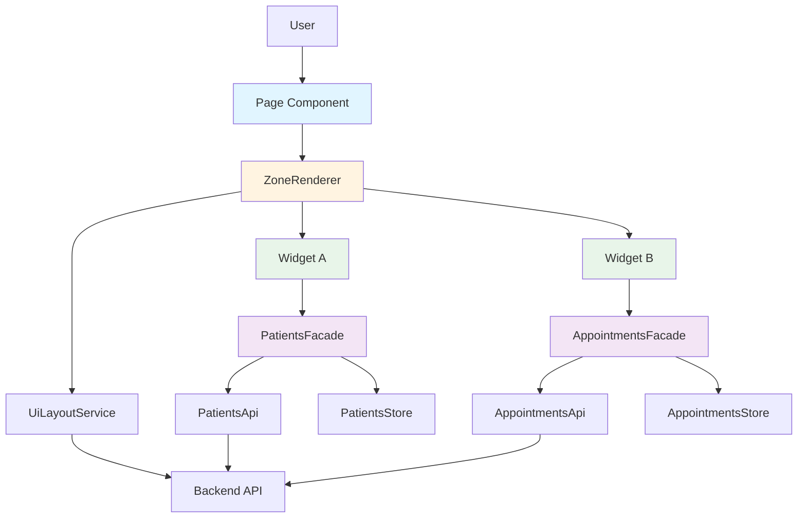

# Frontend Architecture Overview

> **Living Document** - Updated as architecture evolves  
> **Last Updated**: 2026-01-22  
> **For**: Daily reference by development team

---

## Introduction

Vitalia Frontend adopts a **Widget-Domain Architecture** designed for:

- 🏥 **Multi-tenant SaaS** (Hospital/Health domain)
- 📊 **Dynamic dashboards** configurable per tenant
- 🧩 **Reusable components** with clear boundaries
- 🎯 **Domain-driven design** separating business logic from UI
- 🚀 **Scalability** for growing teams and features

This document provides a high-level overview. For decision context, see [ADR-003](../../04-ADR/ADR-003-Widget-Based-Architecture.md).

---

## Architectural Principles

### 1. Domain-Driven Design (DDD)

**Principle**: Business logic lives in the domain layer, not in UI components.

```
UI Components → Facades → Domain Logic
```

- UI is a **projection** of domain state
- Domain is **UI-agnostic** (can be used by widgets, pages, modals)
- Changes in domain don't break UI (and vice versa)

**See**: [Domain Layer Architecture](Domain-Layer-Architecture.md) | [ADR-005](../../04-ADR/ADR-005-Domain-First-Approach.md)

---

### 2. Widget-Based UI

**Principle**: UI is composed of self-contained, configurable widgets.

A **Widget**:
- ✅ Receives configuration via `@Input() config`
- ✅ Consumes data from Facades
- ✅ Emits events for user actions
- ❌ Does NOT make HTTP calls
- ❌ Does NOT know about routes or layouts
- ❌ Does NOT contain business logic

**See**: [Widget System Architecture](Widget-System-Architecture.md) | [ADR-003](../../04-ADR/ADR-003-Widget-Based-Architecture.md)

---

### 3. Metadata-Driven Configuration

**Principle**: Backend orchestrates which widgets to display.

```typescript
// Backend decides based on tenant + permissions
GET /api/ui/layout?zone=admin-dashboard

// Frontend renders what backend says
{
  "widgets": [
    { "type": "patient-stats", "config": {...} },
    { "type": "billing-summary", "config": {...} }
  ]
}
```

**Benefits**:
- Zero-deploy configuration changes
- Tenant-specific UIs
- Permission-based filtering

**See**: [Metadata-Driven UI System](Metadata-Driven-UI-System.md) | [ADR-004](../../04-ADR/ADR-004-Metadata-Driven-UI.md)

---

### 4. Smart/Dumb Component Separation

**Smart Components** (Widgets):
- Know about domain (inject Facades)
- Manage local state
- Handle user interactions

**Dumb Components** (Shared UI):
- Pure presentation
- Receive data via `@Input()`
- Emit events via `@Output()`
- No domain knowledge

---

## The 4-Layer Stack

```
┌─────────────────────────────────────────┐
│  1. Shell & Layout                      │  ← Container, Zones, Routing
├─────────────────────────────────────────┤
│  2. Widgets                             │  ← Smart, Configurable Components
├─────────────────────────────────────────┤
│  3. Domain                              │  ← Business Logic, Facades, State
├─────────────────────────────────────────┤
│  4. Core & Shared                       │  ← Infrastructure, UI Kit
└─────────────────────────────────────────┘
```

### Layer 1: Shell & Layout

**Responsibility**: Application structure and dynamic rendering.

**Key Components**:
- `MainLayout`: Header, Sidebar, Footer
- `ZoneRenderer`: Dynamically instantiates widgets
- `WidgetHost`: Wrapper for widget instances

**Location**: `src/app/layout/`

**Characteristics**:
- UI-aware but **business-agnostic**
- Defines "zones" where widgets can be placed
- No knowledge of specific widgets

---

### Layer 2: Widgets

**Responsibility**: Self-contained, reusable UI components.

**Examples**:
- `PatientStatsWidget`: Shows patient metrics
- `AppointmentListWidget`: Displays upcoming appointments
- `BillingSummaryWidget`: Financial overview

**Location**: `src/app/widgets/`

**Characteristics**:
- Receive `WidgetConfig` via `@Input()`
- Inject **Facades** (not HTTP services)
- Use `computed()` for derived state
- Emit events for actions

**See**: [Creating a Widget](../04-PATTERNS/Creating-A-Widget.md)

---

### Layer 3: Domain

**Responsibility**: Business logic, state management, API communication.

**Structure per domain**:
```
domain/patients/
├── models/
│   └── patient.model.ts       # TypeScript interfaces
├── patients.api.ts            # HTTP client
├── patients.store.ts          # Signal-based state
└── patients.facade.ts         # Public API
```

**Characteristics**:
- **Facades** are the only public API
- **API layer** handles HTTP (no state)
- **Store layer** manages state (no HTTP)
- **Facade layer** orchestrates API + Store

**See**: [Domain Layer Architecture](Domain-Layer-Architecture.md) | [Creating a Domain](../04-PATTERNS/Creating-A-Domain.md)

---

### Layer 4: Core & Shared

**Core** (`src/app/core/`):
- Authentication
- HTTP Interceptors
- Guards
- Logging
- **No UI components**

**Shared** (`src/app/shared/ui/`):
- Dumb components (Button, Card, DataGrid)
- Pipes
- Directives
- UI utilities

---

## Architecture Diagram



---

## Data Flow

### 1. Page Load

```
1. User navigates to /admin/dashboard
2. Page component renders <app-zone-renderer zone="admin-dashboard">
3. ZoneRenderer calls UiLayoutService.getLayout('admin-dashboard')
4. Backend returns widget configuration (filtered by tenant + permissions)
5. ZoneRenderer dynamically instantiates widgets
6. Each widget injects its Facade
7. Widgets call facade.load() methods
8. Facades orchestrate API calls and update Store
9. Widgets react to Store signals and render
```

### 2. User Interaction

```
1. User clicks button in widget
2. Widget emits event or calls facade.doAction()
3. Facade updates Store (optimistic update)
4. Facade calls API
5. API response updates Store (confirmation)
6. All widgets consuming that signal re-render automatically
```

---

## Comparison with Traditional Angular

| Aspect | Traditional Angular | Widget-Domain Architecture |
|--------|---------------------|----------------------------|
| **Routing** | Routes define components | Routes define zones |
| **Data Access** | Components inject HTTP services | Components inject Facades |
| **State** | Component-local or NgRx | Domain Store (Signals) |
| **Reusability** | Limited (page-specific) | High (widgets are portable) |
| **Multi-tenant** | Many if/else statements | Backend configuration |
| **Testing** | Mock HTTP in every test | Mock Facades (simple) |
| **Scalability** | Monolithic components | Composable widgets |

---

## When to Use Each Approach

### ✅ Use Widget-Domain Architecture

- Dashboards with multiple data sources
- Configurable UIs (vary by tenant/role)
- Features used in multiple contexts
- Complex state management needs

### ❌ Use Traditional Components

- Simple CRUD forms
- Static pages (login, about, terms)
- One-off features
- Rapid prototyping

**Hybrid Approach**: Most apps use both. Dashboards use widgets, simple pages use traditional components.

**See**: [When NOT to Use Widgets](../05-BEST-PRACTICES/When-NOT-To-Use-Widgets.md)

---

## Evolution Path

```
Current State          →    Near Future         →    Long Term
─────────────────────────────────────────────────────────────────
Widget Architecture    →    Micro-frontends     →    Federated Modules
Single SPA             →    Multiple teams      →    Independent deploys
Monorepo               →    Multi-repo          →    Module Federation
```

The Widget-Domain architecture is **compatible** with future micro-frontend migration if needed.

**See**: [Enterprise Patterns Mapping](Enterprise-Patterns-Mapping.md)

---

## Quick Start for New Developers

### Reading Order

1. **Start here**: This document (overview)
2. **Understand why**: [ADR-003](../../04-ADR/ADR-003-Widget-Based-Architecture.md), [ADR-004](../../04-ADR/ADR-004-Metadata-Driven-UI.md), [ADR-005](../../04-ADR/ADR-005-Domain-First-Approach.md)
3. **Learn concepts**: [Domain Layer](Domain-Layer-Architecture.md), [Widget System](Widget-System-Architecture.md)
4. **Implement**: [Creating a Domain](../04-PATTERNS/Creating-A-Domain.md), [Creating a Widget](../04-PATTERNS/Creating-A-Widget.md)
5. **Best practices**: [Widget Design Rules](../05-BEST-PRACTICES/Widget-Design-Rules.md)
6. **Templates**: [Domain Boilerplate](../04-PATTERNS/Domain-Boilerplate.md), [Widget Boilerplate](../04-PATTERNS/Widget-Boilerplate.md)

### First Task

Try creating a simple widget:

1. Pick a domain (e.g., `patients`)
2. Create the domain structure (API, Store, Facade)
3. Create a simple widget (e.g., `patient-count-widget`)
4. Register the widget in `WidgetRegistry`
5. Test it in a zone

---

## References

- **ADRs**: [ADR-003](../../04-ADR/ADR-003-Widget-Based-Architecture.md) | [ADR-004](../../04-ADR/ADR-004-Metadata-Driven-UI.md) | [ADR-005](../../04-ADR/ADR-005-Domain-First-Approach.md)
- **Core Concepts**: [Domain Layer](Domain-Layer-Architecture.md) | [Widget System](Widget-System-Architecture.md) | [Metadata-Driven UI](Metadata-Driven-UI-System.md)
- **Implementation**: [Project Structure](../04-PATTERNS/Project-Structure-Guide.md) | [Creating Domains](../04-PATTERNS/Creating-A-Domain.md) | [Creating Widgets](../04-PATTERNS/Creating-A-Widget.md)
- **Best Practices**: [Design Rules](../05-BEST-PRACTICES/Widget-Design-Rules.md) | [Code Review](../05-BEST-PRACTICES/Code-Review-Checklist.md)

---

## Questions?

- **Architecture decisions**: See ADRs in `Documentation/04-ADR/`
- **Implementation help**: See patterns in `Documentation/02-ARCHITECTURE/04-PATTERNS/`
- **Code examples**: See boilerplates in `Documentation/02-ARCHITECTURE/04-PATTERNS/`
- **Team discussion**: Slack #frontend-architecture
