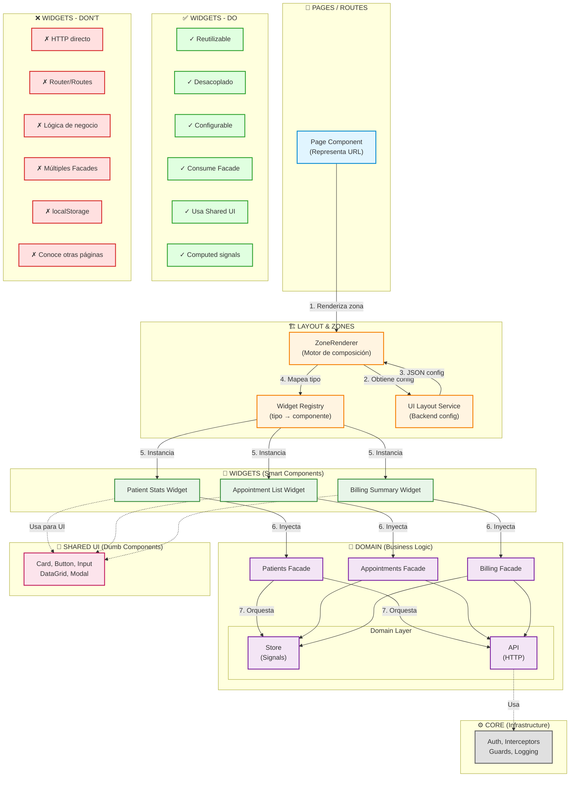
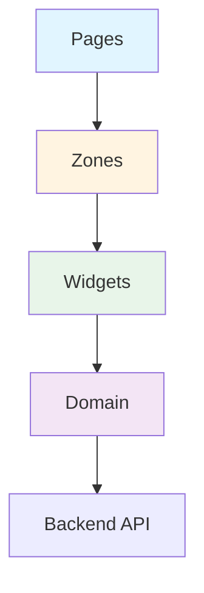

# Mapa Visual de Arquitectura Frontend Vitalia

> **Visual Reference** - Diagrama oficial de la arquitectura Widget-Domain  
> **Last Updated**: 2026-01-22  
> **For**: Onboarding, presentaciones, y referencia rápida

---

## Propósito

Este mapa visual resume toda la arquitectura Frontend de Vitalia en un solo diagrama:
- Capas y responsabilidades
- Flujo de datos
- Reglas DO/DON'T
- Relaciones entre componentes

---

## Diagrama de Arquitectura



---

## Explicación del Flujo

### 1️⃣ Page Component (📄)
- Representa una URL (`/admin/dashboard`)
- Renderiza `<app-zone-renderer zone="admin-dashboard">`
- **NO contiene lógica de negocio**

### 2️⃣ ZoneRenderer (🏗️)
- Motor de composición dinámica
- Obtiene configuración del `UiLayoutService`
- Instancia widgets según `WidgetRegistry`
- **NO decide permisos** (backend ya filtró)

### 3️⃣ Widgets (🧩)
- Smart Components configurables
- Inyectan **solo Facades**
- Usan `computed()` para estado derivado
- Renderizan con componentes `Shared UI`

### 4️⃣ Domain Facades (🧠)
- API pública del dominio
- Orquestan `Store` + `API`
- Previenen llamadas HTTP duplicadas
- **Nunca hacen HTTP directamente**

### 5️⃣ Domain Layer
- **Store**: Estado con Signals
- **API**: Llamadas HTTP
- Completamente desacoplado de UI

### 6️⃣ Shared UI (🎨)
- Componentes Dumb (presentacionales)
- Solo `@Input()` / `@Output()`
- **NO inyectan servicios**

### 7️⃣ Core (⚙️)
- Infraestructura singleton
- Auth, Interceptors, Guards
- **UI-agnostic**

---

## Flujo de Datos Completo

```
Usuario navega a /admin/dashboard
         ↓
Page Component renderiza <app-zone-renderer zone="admin-dashboard">
         ↓
ZoneRenderer llama UiLayoutService.getLayout('admin-dashboard')
         ↓
Backend retorna JSON: [{ type: 'patient-stats', config: {...} }]
         ↓
ZoneRenderer mapea 'patient-stats' → PatientStatsWidget (vía Registry)
         ↓
Widget se instancia con config
         ↓
Widget inyecta PatientsFacade
         ↓
Widget llama facade.loadAll()
         ↓
Facade orquesta PatientsApi.getAll() + PatientsStore.setPatients()
         ↓
Widget usa computed(() => facade.allPatients()) para renderizar
         ↓
Widget usa componentes Shared UI (Card, Button, etc.)
```

---

## Reglas Visuales

### ✅ DO (Verde)
- ✓ **Reutilizable**: Widget usado en múltiples zonas
- ✓ **Desacoplado**: No conoce rutas ni layouts
- ✓ **Configurable**: Recibe `WidgetConfig`
- ✓ **Consume Facade**: Única fuente de datos
- ✓ **Usa Shared UI**: Para presentación
- ✓ **Computed signals**: Para estado derivado

### ❌ DON'T (Rojo)
- ✗ **HTTP directo**: Usar Facade, no `HttpClient`
- ✗ **Router/Routes**: Widget no navega
- ✗ **Lógica de negocio**: Va en Domain
- ✗ **Múltiples Facades**: Un widget = un Facade
- ✗ **localStorage**: No persistencia local
- ✗ **Conoce otras páginas**: Totalmente aislado

---

## Ejemplo Concreto: Patient Stats Widget

```typescript
// ✅ CORRECTO
@Component({
  selector: 'app-patient-stats-widget',
  template: `
    <app-card>
      <h3>{{ config.title }}</h3>
      <p>{{ count() }}</p>
    </app-card>
  `
})
export class PatientStatsWidget {
  @Input() config!: PatientStatsConfig;
  
  private facade = inject(PatientsFacade);  // ✅ Facade
  
  readonly count = computed(() =>           // ✅ Computed
    this.facade.allPatients().length
  );
  
  ngOnInit() {
    this.facade.loadAll();                  // ✅ Facade method
  }
}
```

```typescript
// ❌ INCORRECTO
@Component({...})
export class PatientStatsWidget {
  private http = inject(HttpClient);        // ❌ HTTP directo
  private router = inject(Router);          // ❌ Router
  
  @Input() title!: string;                  // ❌ Múltiples inputs
  @Input() type!: string;
  
  ngOnInit() {
    this.http.get('/api/patients')          // ❌ HTTP directo
      .subscribe(data => {
        const count = data.length;          // ❌ Lógica de negocio
        localStorage.setItem('count', count); // ❌ localStorage
      });
  }
  
  navigate() {
    this.router.navigate(['/other']);       // ❌ Navegación
  }
}
```

---

## Capas y Responsabilidades

| Capa | Responsabilidad | Puede hacer | NO puede hacer |
|------|-----------------|-------------|----------------|
| **Pages** | Representar URL | Renderizar zonas | Lógica de negocio, HTTP |
| **ZoneRenderer** | Composición dinámica | Instanciar widgets | Decidir permisos, lógica |
| **Widgets** | UI configurable | Consumir Facades | HTTP, Router, negocio |
| **Facades** | API pública dominio | Orquestar Store+API | HTTP directo |
| **Store** | Estado (Signals) | Mutaciones de estado | HTTP |
| **API** | Llamadas HTTP | GET/POST/PUT/DELETE | Estado, lógica |
| **Shared UI** | Presentación | Renderizar | Inyectar servicios |
| **Core** | Infraestructura | Auth, logging | UI, negocio |

---

## Uso del Diagrama

### Para Onboarding
1. Mostrar el diagrama en la primera sesión
2. Explicar el flujo de arriba hacia abajo
3. Enfatizar reglas DO/DON'T

### Para Code Reviews
1. Verificar que el código sigue el flujo
2. Validar que no hay flechas "prohibidas"
3. Confirmar que widgets cumplen reglas verdes

### Para Presentaciones
1. Usar como slide principal de arquitectura
2. Explicar cada capa con ejemplos
3. Mostrar flujo completo con caso real

---

## Variantes del Diagrama

### Versión Simplificada (para ejecutivos)



### Versión Detallada (para arquitectos)

Ver diagrama completo arriba con todas las capas, flujos y reglas.

---

## Referencias

- [Vitalia Frontend Architecture](Vitalia-Frontend-Architecture.md)
- [ADR-003: Widget-Based Architecture](../04-ADR/ADR-003-Widget-Based-Architecture.md)
- [Widget Design Rules](05-BEST-PRACTICES/Widget-Design-Rules.md)
- [Domain Layer Architecture](00-CONCEPTS/Domain-Layer-Architecture.md)

---

## Exportar el Diagrama

### Para Wiki/Confluence
1. Copiar el código Mermaid
2. Usar plugin Mermaid
3. El diagrama se renderiza automáticamente

### Para Presentaciones
1. Usar [Mermaid Live Editor](https://mermaid.live)
2. Pegar el código
3. Exportar como PNG/SVG

### Para README.md
1. GitHub/GitLab renderizan Mermaid automáticamente
2. Solo incluir el bloque de código
3. Se verá interactivo

---

**Última actualización**: 2026-01-22  
**Mantenido por**: Equipo Frontend Vitalia  
**Formato**: Mermaid (compatible con GitHub, GitLab, Confluence)
