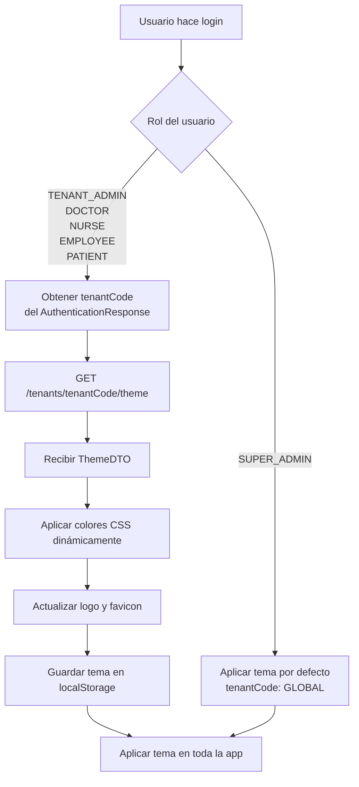

# Plan de Flujo de Autenticación con Temas por Tenant

## Resumen Ejecutivo

Este documento describe el flujo completo de autenticación para la aplicación Vitalia, incluyendo:

- Autenticación diferenciada por roles (SUPER_ADMIN, TENANT_ADMIN, Doctor, Nurse, Patient, **Employee**)
- Carga dinámica de temas personalizados por Tenant
- Integración frontend-backend para aplicar temas en Angular
- **Uso de servicios generados automáticamente con `ng-openapi-gen`**

---

## 1. Arquitectura Actual del Backend

### 1.1 Estructura de Autenticación

Tu backend ya tiene implementado:

```
✅ AuthenticationController
   └─ POST /auth/login
      └─ Retorna: AuthenticationResponse {
            tokens: TokenPairDto (accessToken, refreshToken)
            user: UserSummary (id, email, tenantCode, roles, personType)
         }

✅ ThemeController
   └─ GET /tenants/{tenantCode}/theme
      └─ Retorna: ThemeDTO (colores, logos, fuentes, etc.)
   └─ GET /tenants/config (con header X-Tenant-ID)
      └─ Retorna: ThemeDTO
```

### 1.2 Entidades Clave

**Tenant** (Hospital/Clínica)
- `code`: Identificador único (ej: "HOSPITAL_CENTRAL")
- `name`: Nombre del hospital
- `theme`: Relación OneToOne con Theme

**Theme** (Configuración visual)
- `primaryColor`, `secondaryColor`, `accentColor`
- `logoUrl`, `faviconUrl`
- `fontFamily`
- `themeMode`: LIGHT | DARK | AUTO
- `customCss`: CSS personalizado

**User** (Usuario del sistema)
- `email`, `password`
- `personId`: Referencia a Doctor/Nurse/Patient/Employee

**UserTenantRole** (Relación User-Tenant-Roles)
- Un usuario puede tener diferentes roles en diferentes tenants

---

## 2. Flujos de Autenticación por Rol

### 2.1 SUPER_ADMIN (Administrador Global)

> [!IMPORTANT]
> El SUPER_ADMIN puede acceder a TODOS los tenants y gestionar la plataforma completa.

**Características:**
- ✅ **No requiere especificar tenantCode** en el login
- ✅ Automáticamente se asigna al tenant `GLOBAL`
- ✅ Puede cambiar de tenant después del login
- ✅ Acceso a panel de administración global

**Endpoint:**
```http
POST /auth/login
Content-Type: application/json

{
  "email": "superadmin@vitalia.com",
  "password": "securePassword"
  // tenantCode: null o ausente
}
```

**Respuesta:**
```json
{
  "tokens": {
    "accessToken": "eyJhbGciOiJIUzI1NiIs...",
    "refreshToken": "eyJhbGciOiJIUzI1NiIs..."
  },
  "user": {
    "id": 1,
    "email": "superadmin@vitalia.com",
    "personName": "Super Admin",
    "tenantCode": "GLOBAL",
    "personType": "SUPER_ADMIN",
    "roles": ["ROLE_SUPER_ADMIN"],
    "enabled": true
  }
}
```

---

### 2.2 TENANT_ADMIN (Administrador de Hospital)

> [!IMPORTANT]
> El TENANT_ADMIN gestiona UN hospital específico y debe especificar el tenantCode.

**Características:**
- ⚠️ **DEBE especificar tenantCode** en el login
- ✅ Acceso completo a su tenant
- ✅ Puede gestionar usuarios, doctores, enfermeras, empleados del hospital
- ✅ Puede personalizar el tema del hospital

---

### 2.3 Doctor / Nurse (Personal Médico)

> [!NOTE]
> Doctores y enfermeras pertenecen a UN tenant específico y tienen roles limitados.

**Características:**
- ⚠️ **DEBE especificar tenantCode** en el login
- ✅ Acceso a funcionalidades médicas (pacientes, citas, historias clínicas)
- ✅ Tema personalizado del hospital aplicado automáticamente

---

### 2.4 Employee (Empleado)

> [!NOTE]
> Los empleados son personal administrativo del hospital (recepcionistas, secretarias, etc.)

**Características:**
- ⚠️ **DEBE especificar tenantCode** en el login
- ✅ Acceso a funcionalidades administrativas
- ✅ Gestión de citas, facturación, reportes
- ✅ Tema personalizado del hospital aplicado automáticamente

**Endpoint:**
```http
POST /auth/login
Content-Type: application/json

{
  "email": "employee@hospitalcentral.com",
  "password": "securePassword",
  "tenantCode": "HOSPITAL_CENTRAL"
}
```

---

### 2.5 Patient (Paciente)

> [!NOTE]
> Los pacientes pueden registrarse públicamente y acceder a su portal de paciente.

**Características:**
- ⚠️ **DEBE especificar tenantCode** en el login
- ✅ Acceso limitado a su información médica
- ✅ Puede agendar citas, ver resultados
- ✅ Tema del hospital aplicado

---

## 3. Integración Frontend - Carga de Temas

### 3.1 Flujo de Inicialización del Tema



### 3.2 Implementación en Angular

> [!IMPORTANT]
> **Todos los servicios e interfaces deben generarse automáticamente usando `ng-openapi-gen`**
> 
> Ejecutar: `npm run gen-api`
> 
> Esto genera:
> - `src/app/api/services/authentication.service.ts`
> - `src/app/api/models/authentication-response.ts`
> - `src/app/api/models/theme-dto.ts`
> - Y todos los demás modelos y servicios

**Paso 1: Servicios Generados (Automático)**

Los siguientes servicios ya fueron generados por `ng-openapi-gen`:

```typescript
// src/app/api/services/authentication.service.ts (GENERADO)
// src/app/api/models/authentication-response.ts (GENERADO)
// src/app/api/models/theme-dto.ts (GENERADO)
// src/app/api/models/user-summary.ts (GENERADO)
```

**Paso 2: Crear AuthService Wrapper**

```typescript
// src/app/core/services/auth.service.ts
import { Injectable, Inject, PLATFORM_ID } from '@angular/core';
import { Observable, tap } from 'rxjs';
import { isPlatformBrowser } from '@angular/common';
import { AuthenticationService } from '../../api/services/authentication.service';
import { AuthenticationResponse } from '../../api/models/authentication-response';
import { UserSummary } from '../../api/models/user-summary';
import { Router } from '@angular/router';

@Injectable({ providedIn: 'root' })
export class AuthService {
  
  constructor(
    private authService: AuthenticationService,
    private router: Router,
    @Inject(PLATFORM_ID) private platformId: Object
  ) {}
  
  login(email: string, password: string, tenantCode?: string): Observable<AuthenticationResponse> {
    return this.authService.login({
      body: { email, password, tenantCode: tenantCode || '' }
    }).pipe(
      tap(response => {
        if (response.tokens) {
          this.storeTokens(response.tokens.accessToken!, response.tokens.refreshToken!);
        }
        if (response.user) {
          this.storeUser(response.user);
        }
      })
    );
  }
  
  getCurrentUser(): UserSummary | null {
    if (!isPlatformBrowser(this.platformId)) return null;
    const user = localStorage.getItem('user');
    return user ? JSON.parse(user) : null;
  }
  
  navigateBasedOnRole(roles: string[]): void {
    if (roles.includes('ROLE_SUPER_ADMIN')) {
      this.router.navigate(['/admin/dashboard']);
    } else if (roles.includes('ROLE_ADMIN')) {
      this.router.navigate(['/admin/hospital-dashboard']);
    } else if (roles.includes('ROLE_DOCTOR')) {
      this.router.navigate(['/doctor/dashboard']);
    } else if (roles.includes('ROLE_NURSE')) {
      this.router.navigate(['/nurse/dashboard']);
    } else if (roles.includes('ROLE_EMPLOYEE')) {
      this.router.navigate(['/employee/dashboard']);
    } else if (roles.includes('ROLE_PATIENT')) {
      this.router.navigate(['/patient/portal']);
    }
  }
  
  // ... otros métodos
}
```

**Paso 3: Crear TenantThemeService**

```typescript
// src/app/core/services/tenant-theme.service.ts
import { Injectable, Inject, PLATFORM_ID } from '@angular/core';
import { HttpClient } from '@angular/common/http';
import { Observable, tap } from 'rxjs';
import { DOCUMENT, isPlatformBrowser } from '@angular/common';
import { ThemeDto } from '../../api/models/theme-dto';
import { ApiConfiguration } from '../../api/api-configuration';

@Injectable({ providedIn: 'root' })
export class TenantThemeService {
  
  constructor(
    private http: HttpClient,
    private config: ApiConfiguration,
    @Inject(DOCUMENT) private document: Document,
    @Inject(PLATFORM_ID) private platformId: Object
  ) {}
  
  loadThemeForTenant(tenantCode: string): Observable<ThemeDto> {
    return this.http.get<ThemeDto>(
      `${this.config.rootUrl}/tenants/${tenantCode}/theme`
    ).pipe(
      tap(theme => this.applyTheme(theme))
    );
  }
  
  applyTheme(theme: ThemeDto): void {
    if (!isPlatformBrowser(this.platformId)) return;
    
    localStorage.setItem('tenantTheme', JSON.stringify(theme));
    
    const root = this.document.documentElement;
    if (theme.primaryColor) root.style.setProperty('--primary-color', theme.primaryColor);
    if (theme.accentColor) root.style.setProperty('--accent-color', theme.accentColor);
    // ... aplicar otros colores
  }
}
```

---

## 4. Tabla de Roles y Permisos

| Rol | Tenant Requerido | Puede Cambiar Tenant | Permisos Principales |
|-----|------------------|----------------------|----------------------|
| **SUPER_ADMIN** | No (usa GLOBAL) | ✅ Sí | Gestión completa de plataforma |
| **TENANT_ADMIN** | ✅ Sí | ❌ No | Gestión del hospital |
| **DOCTOR** | ✅ Sí | ❌ No | Gestión de pacientes y citas |
| **NURSE** | ✅ Sí | ❌ No | Asistencia médica |
| **EMPLOYEE** | ✅ Sí | ❌ No | Funciones administrativas |
| **PATIENT** | ✅ Sí | ❌ No | Ver su información médica |

---

## 5. Próximos Pasos de Implementación

1. ✅ **Generar servicios API** con `npm run gen-api`
2. ✅ **Crear AuthService y TenantThemeService**
3. 🔨 **Crear componente de login** con selector de roles
4. 🔨 **Implementar guards de autenticación**
5. 🔨 **Configurar APP_INITIALIZER** para cargar tema al inicio
6. 🧪 **Probar flujos** para cada rol

---

## Conclusión

Este plan proporciona un flujo completo de autenticación multi-tenant con temas personalizados, incluyendo soporte para todos los roles: SUPER_ADMIN, TENANT_ADMIN, DOCTOR, NURSE, EMPLOYEE y PATIENT.
