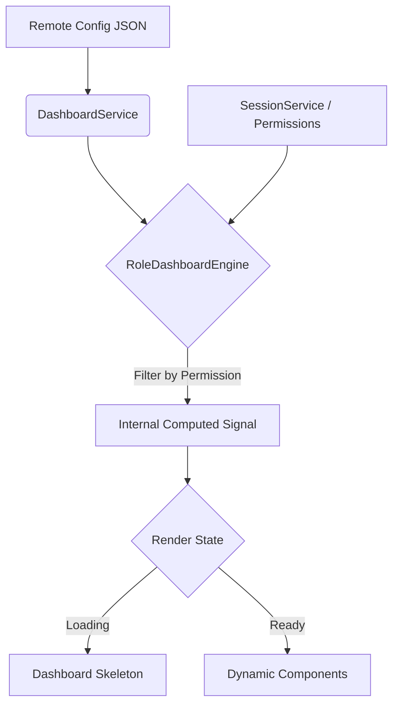

# Dashboard Template Framework (Vitalia)

Este documento describe la arquitectura y el uso del **Dashboard Template Framework**, un motor de rendering dinámico basado en configuración orientado a roles y permisos.

## 🧠 Filosofía del Sistema

Vitalia utiliza un enfoque de **"Configuration-Response Pattern"**. El Dashboard no es una página estática, sino una **carcasa inteligente** (Engine) que renderiza una interfaz basada en un contrato JSON (Config) y lo filtra según los permisos del usuario actual.

### Principios Core:
1. **Estabilidad Estructural**: El layout y el motor son inmutables.
2. **Permission-First Rendering**: Ningún elemento llega al DOM si el usuario no tiene el permiso explícito.
3. **UX Moderna**: Soporte nativo para Skeleton Loaders y i18n reactivo.
4. **Versioning**: Soporta evolución del esquema sin romper implementaciones antiguas.

---

## 🏗️ Arquitectura Técnica

El framework se divide en tres capas:

### 1. Capa de Datos (Data Layer)
Define la estructura mediante el contrato `DashboardConfig`.
- **Ubicación**: [dashboard.model.ts](file:///f:/JAVA-PROJET/vitalia/workspace/vitalia-web/src/app/core/models/dashboard.model.ts)
- **Atributos**: `version`, `stats`, `activities`, `quickActions`.

### 2. Capa de Lógica (Logic Layer - The Engine)
El `RoleDashboardComponent` actúa como el motor de ejecución.
- **Signals**: Utiliza Angular Signals para un flujo de datos reactivo y eficiente.
- **Computed logic**: Procesa el JSON raw y aplica filtros de seguridad en tiempo real.

### 3. Capa de Presentación (UI Layer)
Componentes puramente visuales y atómicos:
- [StatCardComponent](file:///f:/JAVA-PROJET/vitalia/workspace/vitalia-web/src/app/shared/ui/stat-card/stat-card.component.ts)
- [DashboardSkeletonComponent](file:///f:/JAVA-PROJET/vitalia/workspace/vitalia-web/src/app/shared/ui/dashboard-skeleton/dashboard-skeleton.component.ts)

---

## 📊 Flujo de Datos y Renderizado



---

## 📋 JSON Schema (v1)

Cada dashboard se define mediante un archivo JSON (ej: `admin-dashboard.json`).

```json
{
  "version": 1,
  "stats": [
    {
      "id": "staff",
      "titleKey": "dashboard.admin.stats.total_staff",
      "icon": "groups",
      "color": "primary-container",
      "value": 156,
      "requiredPermission": "VIEW_STAFF"
    }
  ],
  "activities": [...],
  "quickActions": [...]
}
```

### Propiedades Clave:
- **`requiredPermission`**: El identificador único del permiso necesario para ver ese widget.
- **`titleKey` / `labelKey`**: Keys de traducción para i18n dinámico.

---

## 🚀 Cómo Implementar un Nuevo Dashboard

1. **Crear el JSON**: Añadir el archivo de configuración en `assets/dashboards/`.
2. **Definir Permisos**: Asegurarse de que el backend o el `PermissionService` conozcan los permisos requeridos.
3. **Configurar Ruta**: Apuntar la ruta del nuevo rol al `RoleDashboardComponent`.
4. **Invocar Carga**: En el `ngOnInit` de la ruta correspondiente, llamar a `loadDashboard('nombre-del-rol')`.

---

## ♿ Accesibilidad y Performance
- **Reduced Motion**: Las animaciones del skeleton se desactivan automáticamente si el usuario lo tiene configurado en su OS.
- **OnPush Strategy**: El motor de renderizado solo se activa cuando los datos o los permisos cambian, maximizando el rendimiento.
