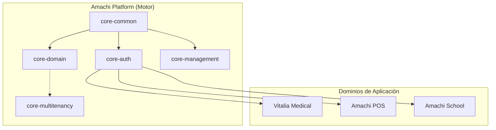
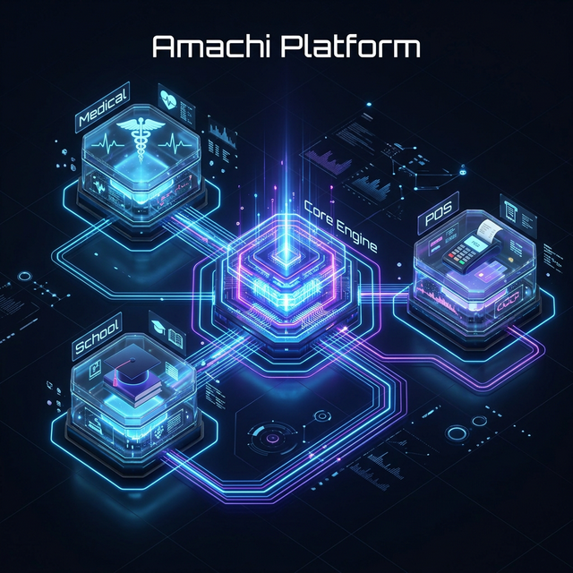

# Especificación de Arquitectura SaaS — "Amachi Platform"

Este documento define la base arquitectónica para transformar la infraestructura actual en una plataforma SaaS multi-dominio (Hospitales, POS, Escuelas).

---

## 1. Identidad de la Plataforma e Interfaz
*   **Platform Core**: Se denomina **Amachi Platform**. El nombre "Vitalia" se reserva solo para el módulo médico (**Vitalia Medical**).
*   **Interfaz de Pertenencia**: **`TenantScoped`**. Indica que una entidad pertenece a un inquilino.

### Contrato Técnico
Para garantizar la herencia y el aislamiento, toda entidad multi-dominio seguirá este patrón:
```java
public interface TenantScoped {
    Long getTenantId();
    void setTenantId(Long tenantId);
}

@MappedSuperclass
@Filter(name = "tenantFilter", condition = "tenant_id = :tenantId")
public abstract class BaseTenantEntity extends BaseEntity implements TenantScoped {
    @Column(name = "tenant_id", nullable = false)
    private Long tenantId;
}
```

## 2. Estrategia de Aislamiento: Shared Schema
Vitalia utiliza la estrategia de **Shared Database / Shared Schema**.
*   **Aislamiento**: Realizado mediante filtrado lógico (`tenant_id`) en cada tabla.
*   **Fail-Safe**: Hibernate Filters heredados desde una `@MappedSuperclass` común para todas las entidades que implementen `TenantScoped`.

## 3. El Modelo de Datos de 3 Capas (Evolucionado)

| Capa | Pertenencia | Estrategia de Actualización | Ejemplo |
| :--- | :--- | :--- | :--- |
| **Global** | Sistema | Constante / Centralizada | ICD10, Paises |
| **Plantilla** | Sistema → Tenant | **Versionada** (`TEMPLATE_VERSION_V1`) | Roles Base, Tasas |
| **Tenant** | Inquilino | **`TenantScoped`** (Aislado) | **Producto, Venta, Alumno** |

---

## 4. Identidad Técnica: ID vs CODE
*   **ID (Technical Key)**: `Long`. Inmutable, clave para índices y relaciones FK.
*   **CODE (Business Key)**: `String`. Legible, estable para integraciones.
    *   *Regla de Formato*: **slug-lowercase** para URLs y registros de negocio.
    *   *Regla de Unicidad*: El `CODE` debe ser único **dentro del mismo tenant**: `UNIQUE(tenant_id, code)`.

---

## 5. Arquitectura de Dominio Modular (Actualizada)
El sistema se organiza separando la infraestructura (Core) de las reglas de negocio (Domains):



*   **`core-multitenancy`** (Concepto): Agrupa la lógica transversal de aislamiento (Filtro, Contexto, Interfaz).
*   **`core-management`**: Anteriormente `vitalia-management`. Gestiona suscripciones, onboarding y ciclos de vida de tenants de forma agnóstica.
*   **`vitalia-medical`**: Anteriormente `vitalia-clinical`. Contiene toda la lógica de salud, pacientes y registros médicos.



## 6. Onboarding Dinámico
El registro de un nuevo inquilino dispara un proceso automático (Runtime):
1.  **Signup** → Crea `Tenant` en DB.
2.  **Identity** → Crea `Admin` inicial.
3.  **Bootstrap** → Carga `Templates` (v-latest) de Roles y Catálogos.
4.  **Localization** → Inicializa configuraciones por defecto (`Timezone`, `Currency`, `Language`).
5.  **Tenant Ready**.

---

## 7. Reglas de Desempeño y Seguridad
Para garantizar la integridad y velocidad del SaaS:
*   **Indexación Obligatoria**: Toda tabla `TenantScoped` **debe** tener un índice compuesto o simple en `tenant_id`.
*   **Not Null**: La columna `tenant_id` nunca puede ser nula en tablas de inquilino.
*   **Filtro Siempre Activo**: Las consultas a través de JPA deben asegurar que el filtro de Hibernate esté habilitado para evitar "data leakage" entre tenants.
