# 🗺️ MIGRATION GUIDE: PAL to Material 3

This document serves as the official roadmap and standard operating procedure for the engineering team during the transition to Angular Material 3.

---

## 1. 🔄 The Master Workflow
Visualizing the safe path from Legacy to Modern.

---

## 2. 🚦 Live Kanban Status
Track real-time progress of critical components.

```mermaid
graph TD
    subgraph "🔴 PENDING"
        Toast
        Card
        Snackbar
        Grid
    end
    
    subgraph "🟡 IN QA (Storybook)"
        Dialog[Dialog / Confirm]
    end
    
    subgraph "🟢 INTEGRATED (Done)"
        Input
        Button
        Select
        Checkbox
        Radio
    end
    
    Dialog -->|Next| Input
```

---

## 3. 📋 Daily Rituals (SOP)

### Morning Prep
1. Open **Storybook** (`comparison-*` stories).
2. Check **ThemeService** health (Light/Dark toggle).
3. Pick **1 Target Component** from Pending list.

### Execution Checklist
- [ ] **API Parity**: Inputs/Outputs match PAL Old.
- [ ] **Tokens**: Use `--mat-sys-*` variables (Colors, Typography).
- [ ] **Density**: Verify `compact` vs `default`.
- [ ] **Theming**: Check Light vs Dark mode.
- [ ] **Reference**: Compare pixel-feel with PAL Old.

### Closing
- [ ] **Visual Approval**: Sign-off in Storybook.
- [ ] **Merge**: Replace legacy component in `shared/ui`.
- [ ] **Update Board**: Move card to "Integrated".

---

## 4. 🎯 Success Criteria
The migration is considered successful when:
1. **Zero CSS**: No manual styles in components; only Tokens.
2. **Multi-Tenant**: Tenant A/B/C render correctly from config.
3. **Accessibility**: Native Material accessibility is preserved.
4. **Stability**: No regressions in existing forms.

> **Keep Storybook as the Source of Truth.** If it looks wrong there, it's wrong everywhere.
