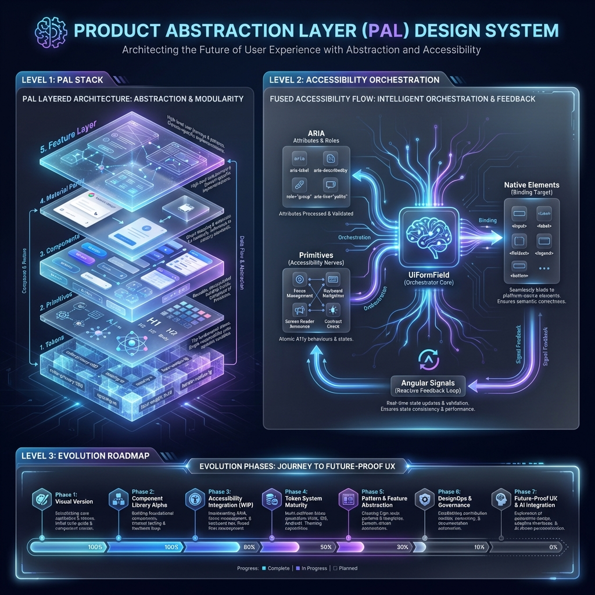

# PAL Quick Start - Uso Rápido de UiFormField



Esta guía proporciona ejemplos rápidos para implementar formularios profesionalmente usando el PAL, garantizando accesibilidad y micro-interacciones premium de forma automática.

## 1. Instalación e Imports

Todos los componentes son **standalone** y deben importarse en el array `imports` de tu componente o módulo:

```typescript
import { UiFormFieldComponent } from '@shared/ui';
import { UiInputComponent } from '@shared/ui';
import { UiSelectNativeComponent } from '@shared/ui';
```

## 2. Uso Básico: UiFormField + UiInput

El `UiFormField` actúa como orquestador gestor de la "inteligencia" del campo.

```html
<ui-form-field label="Nombre" hint="Escribe tu nombre completo" [required]="true">
  <ui-input
    type="text"
    placeholder="Ej. Juan Pérez"
    [(ngModel)]="userName"
  ></ui-input>
</ui-form-field>
```

**¿Qué sucede automáticamente?**
*   **Semantic Linking**: Se generan IDs únicos y se vinculan vía `aria-describedby`.
*   **State Sync**: Los estados `invalid`, `required` y `disabled` se propagan al input nativo.
*   **Micro-UX**: El label flota con una curva de 180ms y el campo tiene feedback de **shake** ante errores.

## 3. Uso Avanzado: UiFormField + UiSelectNative

```html
<ui-form-field label="País" hint="Selecciona tu país" [required]="true">
  <ui-select-native
    [options]="countryOptions"
    placeholder="Selecciona un país"
    [(ngModel)]="selectedCountry"
    [searchable]="true"
  ></ui-select-native>
</ui-form-field>
```

**Mejoras incorporadas:**
*   **Accessibility Pro**: Cada opción tiene un ID único para `aria-activedescendant`.
*   **Foco Resiliente**: El panel no se cierra al interactuar con el buscador interno.
*   **Navegación**: Soporte completo para teclado (Flechas, Enter, Escape).

## 4. Estados y Validaciones

Cuando usas Angular Forms, el PAL detecta el estado automáticamente:

```typescript
// En el componente TS
hasError = false;

validateForm() {
  this.hasError = !this.userName;
  if (this.hasError) {
    // El feedback visual (shake + color) aparecerá automáticamente
  }
}
```

## 5. Personalización de Tamaño y Apariencia

El PAL respeta el **Contrato Geométrico** en todas sus variantes:

```html
<ui-form-field label="Email" [size]="'sm'" [appearance]="'filled'">
  <ui-input type="email" placeholder="ejemplo@correo.com"></ui-input>
</ui-form-field>
```

*   **Tamaños**: `'sm'` | `'md'` (default) | `'lg'`.
*   **Apariencias**: `'outline'` (default) | `'filled'`.

## 6. Notas Clave para Desarrolladores

*   ⚠️ **No manipules IDs manualmente**: El *Fused Accessibility Pattern* los gestiona por ti.
*   ✅ **Usa Signals**: Los componentes exponen Signals como `focused()`, `empty()` y `hasError()` para lógica reactiva personalizada.
*   🚀 **UI Parity**: Los componentes de Angular Material integrados serán automáticamente adaptados por el sistema de paridad del PAL.

---

> Para una inmersión profunda en la arquitectura, consulta la [Guía Técnica de Estilos](../../styles/ds/README.md).
