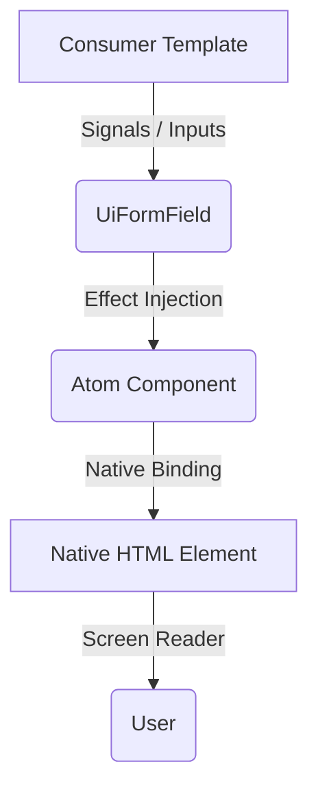

import { Meta, Markdown } from '@storybook/blocks';

<Meta title="Docs/Reactive Architecture" />

# 🧠 Reactive Accessibility Engine

El **Product Abstraction Layer (PAL)** no es solo una colección de componentes visuales; es un **motor semántico** gobernado por **Angular Signals**. 

Su objetivo principal es garantizar que la accesibilidad (ARIA) sea **fused** (fundida) con el estado lógico, sin desfases temporales ni errores de sincronización manual.

## El Flujo de Datos

El diseño sigue el patrón de **Orquestador y Átomos**:

1.  **UiFormField (Orquestador)**: Centraliza la lógica de negocio (errores, hints, validaciones, IDs).
2.  **UiInput/UiSelectNative (Átomos)**: Reciben el estado semántico y lo inyectan en el DOM nativo.



## Arquitectura de Señales

Utilizamos **Signal Inputs** (`input()`) en `UiFormField` para asegurar que cualquier cambio en las propiedades (`label`, `error`, `required`) dispare instantáneamente un `effect()`.

### 1. Inyección de Estado
El orquestador inyecta las propiedades ARIA directamente en el componente átomo (que se obtiene mediante `@ContentChild`).

```typescript
// En UiFormFieldComponent
effect(() => {
  const atom = this.atom();
  if (atom) {
     atom.ariaRequired = this.required();
     atom.ariaInvalid = this.hasError();
     // ...
  }
});
```

### 2. Sincronización en el Átomo
Los átomos implementan **setters reactivos** que llaman a `markForCheck()`. Esto garantiza que, incluso bajo `ChangeDetectionStrategy.OnPush`, la UI se actualice en el siguiente microtask.

```typescript
// En UiInputComponent
@Input() set ariaInvalid(val: boolean) {
  this._ariaInvalid.set(val);
  this.cdr.markForCheck();
}
```

## Beneficios
- **WCAG 2.1 AA by Default**: Un desarrollador no tiene que preocuparse por vincular IDs de errores; el motor lo hace automáticamente.
- **Rendimiento Máximo**: Solo los componentes afectados por un cambio de señal se re-renderizan.
- **Testabilidad Total**: El estado de accesibilidad se puede verificar mediante señales antes de llegar al DOM.
