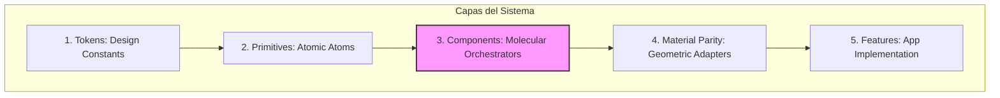
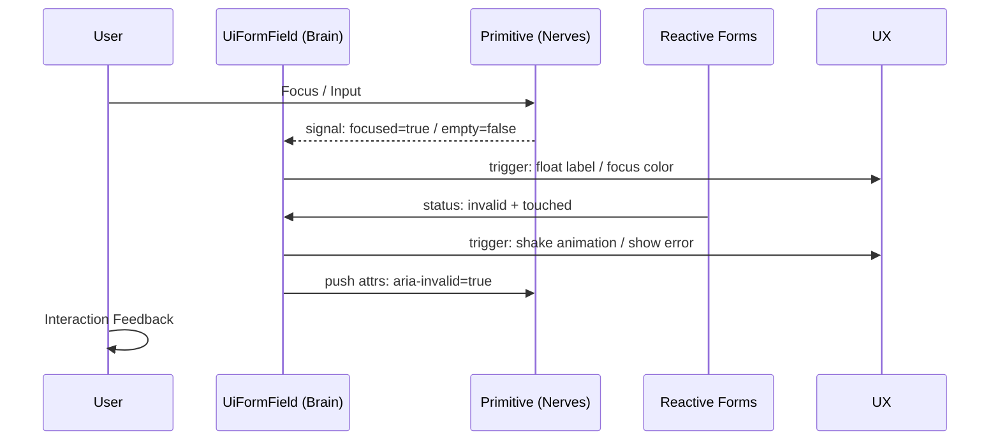

# PAL (Product Abstraction Layer) - Architecture & Design System

## Guía Visual del Sistema

La infografía superior sintetiza los tres pilares del PAL:

### Nivel 1: El Stack de Capas (Arquitectura Modular)
El PAL se construye de abajo hacia arriba para garantizar desacoplamiento:
*   **Tokens (Base)**: Definiciones atómicas de diseño.
*   **Primitives (Nerves)**: Átomos puros (`ui-input`, `ui-select-native`) que conectan con el DOM.
*   **Components (Brain)**: `UiFormField` como el orquestador que inyecta inteligencia.
*   **Material Parity**: El puente que uniformiza los componentes externos de Material Design.
*   **Feature Layer**: La aplicación final que consume el sistema.

### Nivel 2: Fused Accessibility Flow (Inteligencia de Interacción)
Representa cómo viaja la información entre el orquestador y los elementos nativos:
*   **Inyección ARIA**: El orquestador empuja estados (`invalid`, `required`) hacia los nervios.
*   **Reactive Feedback**: Los átomos reportan su estado mediante **Angular Signals** (`focused`, `empty`).
*   **Impacto Final**: Una experiencia perfecta para lectores de pantalla y navegación por teclado.

### Nivel 3: Roadmap de Madurez (Visión a Largo Plazo)
Nuestra hoja de ruta desde la estabilización hasta la innovación:
*   **Phases 1-4**: Foco en consistencia, QA, documentación y escalabilidad global (i18n/RTL).
*   **Phases 5-7**: Foco en ecosistema (SaaS Kit), performance extrema y una UX adaptable al futuro.

---

## 1. Arquitectura de 5 Capas

El PAL está organizado en capas de abstracción para garantizar **desacoplamiento** y **escalabilidad**:

1. **Tokens**: Variables base (colores, sombras, tamaños como `--ui-size-md`). No contienen lógica.
2. **Primitives (Atoms)**: Envoltorios ligeros sobre inputs nativos (`ui-input`, `ui-select-native`). Poseen el contrato de accesibilidad pero no los bordes/labels.
3. **Components (Molecules)**: Componentes complejos como `ui-form-field`. Orquestan la accesibilidad y el micro-UX.
4. **Material Parity Layer**: Adaptadores CSS (`_material-parity.scss`) que fuerzan a Angular Material a comportarse físicamente como el PAL y respetan el **Contrato Geométrico**.
5. **Feature Layer**: Implementación de negocio que consume los componentes del PAL.

---

## 2. El Contrato Geométrico ("Iron Base")

Para garantizar una **alineación perfecta de 1px** en toda la aplicación, el PAL utiliza un **modelo matemático determinista**:

* **Host-Driven Height**: El contenedor padre (`form-component-host`) es el único dueño de la altura física (`height` y `min-height`).
* **Flex-Centering DNA**: El centrado vertical se logra mediante `display: flex; align-items: center` en el host, eliminando la dependencia de `line-height` o padding vertical.
* **Zero-Padding Inner**: Los elementos internos (inputs, selects) tienen **prohibido** el padding vertical (`padding: 0`).
* **Line-Height Normalizado**: Se usa `line-height: normal` para evitar herencias del body que desplacen el texto.

> Todas las adaptaciones de Material (`_material-parity.scss`) respetan este Contrato Geométrico, asegurando paridad visual con el PAL.

---

## 3. Reactive Accessibility Engine (Fused Accessibility)

El sistema utiliza un **Reactive Accessibility Engine** basado en **Angular Signals** para cumplir con **WCAG 2.1 AA** garantizando sincronización en tiempo real:

### Orquestación (UiFormField)
* Genera IDs únicos para labels, hints y errores.
* Detecta automáticamente el estado del formulario (`dirty`, `touched`, `invalid`).
* **Propagación**: Inyecta dinámicamente los atributos `aria-describedby`, `aria-invalid` y `aria-required` en los componentes hijos.

### Receptores (Primitives)
* Reciben los atributos ARIA procesados y los vinculan a los elementos nativos (`<input>`, `<select>`).
* Manejan el ciclo de vida del foco y comunican su estado (`focused`, `empty`) mediante **Signals** (reactive primitives de Angular 17+).

### Screen Reader Excellence
* Los atributos ARIA se recalculan de forma reactiva ante cualquier cambio en los inputs del componente (`label`, `error`, `hint`, `required`), asegurando que las tecnologías asistivas reciban estados precisos sin intervención manual del desarrollador.

---

## 4. Micro-interacciones Premium

El **feedback cognitivo** está unificado para que la app se sienta "viva":

* **Transiciones**: 180ms `ease-out` para todos los cambios de estado visual.
* **Error Feedback**: Animación de **Shake** (250ms) al enfocar un campo con errores:

┌───┐ → ──┐ → ───┐ (movimiento lateral sutil)

* **Visual Stability**: Los mensajes de error/pista aparecen con `fade-in-up` para evitar saltos bruscos.
* **Floating Labels**: La etiqueta del campo flota suavemente y escala proporcionalmente, manteniendo consistencia visual y accesible.

---

## 5. Filosofía de Diseño

* La **consistencia visual** y la **accesibilidad** son prioridades iguales.
* Cada componente es **predecible, escalable y reutilizable**.
* El PAL es la **Fuente de Verdad** para cualquier modificación física o lógica en el Design System de Vitalia.

---

> [!IMPORTANT]
> **Hoja de Ruta y Seguimiento**: Para consultar el estado de ejecución de las fases de madurez, revisa el **[CHECKLIST.md](./CHECKLIST.md)**.
> **Evolución del Sistema**: Revisa el último **[WALKTHROUGH.md](./WALKTHROUGH.md)** para una síntesis técnica de los últimos refinamientos realizados.
