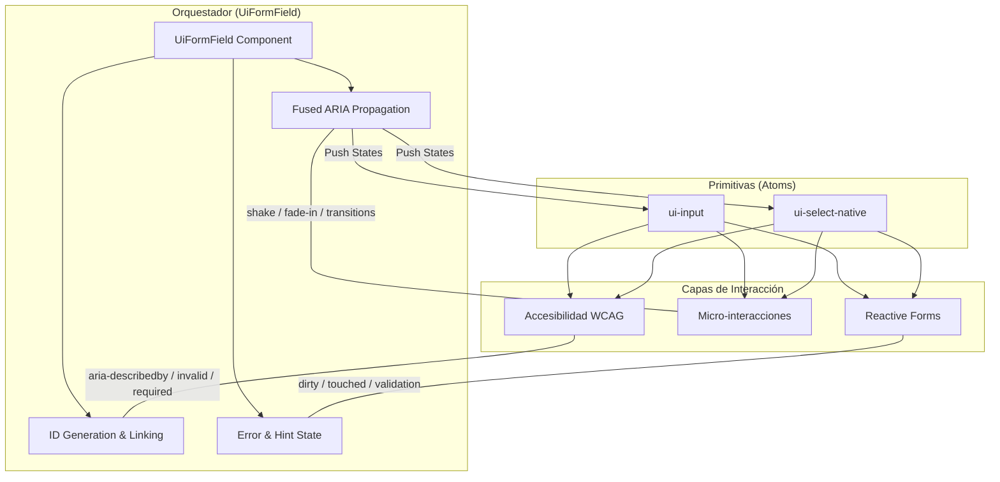

# Walkthrough - Inteligencia de Interacción y Refinamientos Pro (Fase Final)

## Síntesis de Ingeniería (Los 3 Niveles del PAL)

Este documento resume las decisiones técnicas tomadas durante la fase de estabilización final del PAL:

1.  **Nivel 1: El Stack "Iron Base"**: Representa la jerarquía física desde los **Tokens** (el ADN del diseño) hasta la **Feature Layer**. La capa de **Material Parity** es la que "disfraza" a Angular Material para que respete nuestras reglas geométricas sin fisuras.
2.  **Nivel 2: El Cerebro (Orquestador ARIA)**: Visualiza el flujo de datos reactivos. `UiFormField` inyecta la inteligencia de accesibilidad necesaria para que los lectores de pantalla entiendan el estado del campo en tiempo real, mientras las **Signals** de Angular 17+ cierran el loop de feedback constante.
3.  **Nivel 3: Roadmap de Excelencia**: Una hoja de ruta clara que lleva al PAL desde su estabilización actual hasta una madurez total con **Storybook Premium**, soporte **i18n/RTL** y una UX adaptativa capaz de auto-corregirse.

## Arquitectura: El Sistema Nervioso (Fused Pattern)

Este diagrama representa cómo el `UiFormField` actúa como el orquestador inteligente del sistema, vinculando la lógica de negocio (Forms) con la accesibilidad y la experiencia de usuario.

## 1. Accesibilidad Avanzada (Audit-Ready)
Hemos implementado características de accesibilidad de nivel "Enterprise":
- **`aria-activedescendant`**: El `UiSelectNative` comunica exactamente qué opción está enfocada mediante IDs dinámicos.
- **Propagación Automática**: El `UiFormField` hereda su label y lo inyecta como `aria-label` de respaldo si es necesario.
- **Foco Resiliente**: Refinado el comportamiento de `onBlur` para evitar cierres accidentales en paneles interactivos.

## 2. Micro-interacciones y Feedback Cognitivo
- **Error Shake**: Animación de 250ms que se activa ante errores al interactuar.
- **Transiciones de 180ms**: Unificación de curvas de animación para una sensación fluida y premium.

## 3. Limpieza Arquitectónica
- **Optimización de Host**: Eliminación de anclajes CSS innecesarios en TypeScript, delegando a SCSS.
- **Estructura SCSS**: Agrupación lógica por Geometría, Estados e Interacciones.

---

> [!TIP]
> **Referencia Técnica**: Consulta el [README.md](./README.md) para detalles profundos sobre la arquitectura y el [CHECKLIST.md](./CHECKLIST.md) para el seguimiento del roadmap.

---

El PAL de Vitalia es ahora un activo de ingeniería de alto valor, listo para escalar a cientos de formularios con total confianza.
